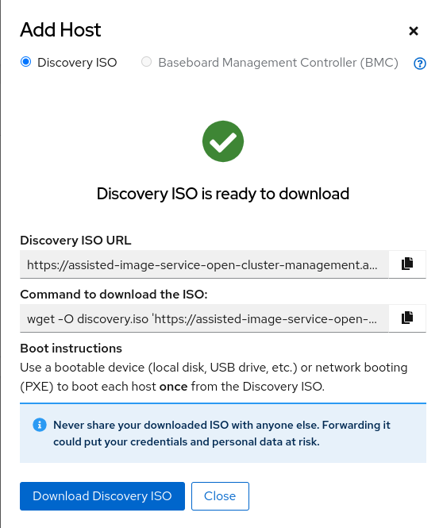

# GUI-Based Openshift Deployments Using Advanced Cluster Management 

Many organizations are coming to a realization that their cloud architecture won't include only the core data center as the central place for storing and processing organizational data.

With the `Distributed Cloud`, we'll have smaller clouds distributed across several locations - It could be three-node-clusters, single-node-clusters, or even small maneuvering devices that will have to carry our workloads reliably to the edge and process our data far away from the core data center.

With these assumptions, how do we deploy those smaller clouds to a place where we have no control? how do we manage the lifecycle of what can and can't be done in a place we have no control in? how do we roll our application to those edge clouds? how do we manage to secure those clouds when they are so far away?
With all the advantages the distributed cloud has, there are a lot of challenges as well and it's better for us to know the answers before going into something like such.

This is why I wanted to talk with you about `Advanced Cluster Management` and show you how it can be the layer that we can rely on to answer all these questions presented above.
With ACM, we'll be able to deploy those clouds from the core data center no matter where or which infrastructure it should be hosted on, We could control security & governance policies and deploy workloads to the edge.
In this demo, I'll show you how we can deploy a `Single Node Openshift (SNO)` cluster using ACM's `Central Infrastructure Management` component.

Game On! 

## Prerequisites 

* A running Openshift cluster (preferred to be > 4.9), Representing the `Hub Cluster`
* ACM operator installed on the `Hub Cluster`
* Network connectivity between the `Hub Cluster` and the infrastructure hosting the `SNO`


### Preparing the Hub Cluster 

Please make sure you have the right context that points to the `Hub Cluster`, Makre sure that you have a `cluster-admin` access to ACM as well: 


Now that we have all the access that we need, we can go and configure our first component which is called `AgentServiceConfig`. 

With ACM in version 2.4.1, the `Central Management Infrastructure (CIM)` component comed enabled by default and we'll only have to configure it: 

```bash
$ oc apply -f << EOF >> 

apiVersion: agent-install.openshift.io/v1beta1
kind: AgentServiceConfig
metadata:
 name: agent
spec:
  databaseStorage:
    accessModes:
    - ReadWriteOnce
    resources:
      requests:
        storage: 10Gi
  filesystemStorage:
    accessModes:
    - ReadWriteOnce
    resources:
      requests:
        storage: 20Gi
  osImages:
    - openshiftVersion: "4.9"
      version: "49.83.202103251640-0"
      url: "https://mirror.openshift.com/pub/openshift-v4/dependencies/rhcos/4.9/4.9.0/rhcos-4.9.0-x86_64-live.x86_64.iso"
      rootFSUrl: "https://mirror.openshift.com/pub/openshift-v4/dependencies/rhcos/4.9/4.9.0/rhcos-live-rootfs.x86_64.img"
      cpuArchitecture: "x86_64"
EOF
```

**Note Alert!**

* `url` - Points to where you store the live-iso ofr your wanted RHCOS image, in an air-gapped environment, It could be pointing to a pre-created Apache server. 

* `rootFSUrl` - Points to where you store your live-rootfs file for your wanted RHCOS image, in an air-gapped environment, It could be pointing to a pre-created Apache server too. 

* Make sure that you have storage classes configured for both file and block storage, as the Custom Resource presetned here is creating them both automatically. 

Now that we have our `CIM` configured, Let's start and prepare all the needed resources for the installation. 

First, let's create a new project that will host our new deployment's configuration: 

```bash
$ oc new-project ocp-aio
```

Now, let's create the first object which will represent the pull secret that we use in order to pull images for the installation: 

```bash
$ oc create -f << EOF >>

apiVersion: v1
kind: Secret
metadata:
  name: assisted-deployment-pull-secret
  namespace: ocp-aio
stringData:
  .dockerconfigjson: '{"auths"...'
EOF
```

Make sure you fill in your pull secret completely. 

Next, we'll create a Custom Resource called `InfraEnv` that basically provides ACM the ability to describe our environment and how does it look like: 

```bash
$ oc create -f << EOF >>

apiVersion: agent-install.openshift.io/v1beta1
kind: InfraEnv
metadata:
  name: ocp-aio
  namespace: ocp-aio
spec:
  clusterRef:
    name: ocp-aio
    namespace: ocp-aio
  sshAuthorizedKey: 'ssh-rsa...'
  agentLabelSelector:
    matchLabels:
      cluster-name: ocp-aio
  pullSecretRef:
    name: assisted-deployment-pull-secret
  nmStateConfigLabelSelector:
    matchLabels:
      cluster-name: ocp-aio
EOF
```

Then, we'll create a Custom Resource called `Cluster Deployment` that tells ACM that there is a new cluster that we want to start and deploy: 

```bash
$ oc create -f << EOF >>

apiVersion: hive.openshift.io/v1
kind: ClusterDeployment
metadata:
  name: ocp-aio
  namespace: ocp-aio
spec:
  baseDomain: spaz.local
  clusterName: ocp-aio
  controlPlaneConfig:
    servingCertificates: {}
  clusterInstallRef:
    group: extensions.hive.openshift.io
    kind: AgentClusterInstall
    name: ocp-aio
    version: v1beta1
  platform:
    agentBareMetal:
      agentSelector:
        matchLabels:
          cluster-name: "ocp-aio"
  pullSecretRef:
    name: assisted-deployment-pull-secret
EOF
```

**Note Alert!**

* Make sure that you have youe base domain pre-configured and all the needed records were created in your organizational DNS 

* All DNS records needed are the same records needed for a regular Openshift installation (api, api-int, *apps, hosts records)

Next, we'll create another Custom Resource called `AgentClusterInstall` which basically creates all the needed configs, and very similar to the `install-config` that we know from regular Openshift installations: 

```bash
$ oc create -f << EOF >>

apiVersion: extensions.hive.openshift.io/v1beta1
kind: AgentClusterInstall
metadata:
  name: ocp-aio
  namespace: ocp-aio
spec:
  clusterDeploymentRef:
    name: ocp-aio
  provisionRequirements:
    controlPlaneAgents: 1
  imageSetRef:
    name: 'img4.9.18-x86-64-appsub'
  networking:
    clusterNetwork:
    - cidr: 10.128.0.0/14
      hostPrefix: 23
    serviceNetwork:
    - 172.30.0.0/16
    machineNetwork:
    - cidr: 192.168.1.0/24
  sshPublicKey: 'ssh-rsa...'
EOF
```

If you'll notice, This CR refers to the previosly created CR that creates the request for a cluster deployment. 

**Note** - Make sure that you insert the correct `machineNetwork` that will suite you environment. 

### Preparing the Klusterlet Agent 

As ACM deploys an agent on each managed cluster, We'll now create all the needed resources for our `SNO` to be managed by ACM: 

```bash 
$ oc create -f << EOF >>

apiVersion: cluster.open-cluster-management.io/v1
kind: ManagedCluster
metadata:
  name: ocp-aio
  namespace: ocp-aio
spec:
  hubAcceptsClient: true
EOF
```

This CR tells ACM that the requested cluster to be deployed should be managed by ACM. 

```bash
$ oc create -f << EOF >>

apiVersion: agent.open-cluster-management.io/v1
kind: KlusterletAddonConfig
metadata:
  name: ocp-aio
  namespace: ocp-aio
spec:
  clusterName: ocp-aio
  clusterNamespace: ocp-aio
  clusterLabels:
    cloud: hybrid
  applicationManager:
    enabled: true
  policyController:
    enabled: true
  searchCollector:
    enabled: true
  certPolicyController:
    enabled: true
  iamPolicyController:
    enabled: true
EOF
```

This CR tells ACM which of the management layers that ACM can provide should be implemented on the managed `SNO`, for the sake of this PoC, we'll go for all of them. 

### Preparing The SNO 

Now that we are finished with preparing the needed configuration for our `Hub Cluster`, we can start and prepare our `SNO` for installation. 

In the `Advanced Cluster Management` dashboard, navigate to `Infrastructure Environments`, click `Hosts` and then `Add Host`: 



Now that you have the ISO, make sure you boot your `SNO` from it. 

**Note Alert!**

This ISO file will be suitable no matter how many hosts you want in your Openshift installation, you can just mount it to other machines as well if you'd like to have more. 


Approve your added host until you see it reaching to a `Ready` state. 

As we have created all the needed resources for the cluster to prepare the installation, once we have the host in a `Ready` state the CIM service can start and deploy it. 

Navigate to `Clusters` and make sure your new host is under an installation process, and wait for the installation to finish: 


**Note Alert!**

We see that we get all the needed information for the created cluster: 

* The Openshift console endpoint to log in the `SNO` 
* the `kubeadmin` password that is created as part of the installation
* Cluster name, versions, labels, subnets, etc 

Make sure you observe all the metrics sent from the SNO using the `ACM Overview` panel: 


### Deploying A GitOps App

Now that we have our `SNO` created using the CIM service, we can continue and deploy a `GitOps` based application to it. 

First, Let's label our node with the proper label to identify the `SNO` cluster that we have just created: 


We have labeled our node with `flavor: singlenode` and we'll use this label with deploying the application. 

If we'd have more clusters tagged with this label, The `GitOps` application would have been deployed to it as well. 

Next, Let's create the suitable Custom Resource that will tell `ACM` that we want to deploy our first `GitOps` app: 

```bash
$ oc create -f << EOF >>

apiVersion: v1
kind: Namespace
metadata:
  name: book-import
---
apiVersion: app.k8s.io/v1beta1
kind: Application
metadata:
  name: bookimport
  namespace: book-import
spec:
  componentKinds:
  - group: apps.open-cluster-management.io
    kind: Subscription
  descriptor: {}
  selector:
    matchExpressions:
      - key: app
        operator: In
        values: 
          - bookimport
---
apiVersion: apps.open-cluster-management.io/v1
kind: Channel
metadata:
  annotations:
    apps.open-cluster-management.io/reconcile-rate: medium
  name: ggithubcom-stolostron-demo-subscription-gitops
  namespace: book-import
spec:
  type: Git
  pathname: 'https://github.com/stolostron/demo-subscription-gitops.git'
---
apiVersion: apps.open-cluster-management.io/v1
kind: Subscription
metadata:
  annotations:
    apps.open-cluster-management.io/git-branch: master
    apps.open-cluster-management.io/git-path: book-import/app
    apps.open-cluster-management.io/reconcile-option: merge
  labels:
    app: bookimport
  name: bookimport-subscription-1
  namespace: book-import
spec:
  channel: book-import/ggithubcom-stolostron-demo-subscription-gitops
  placement:
    placementRef:
      kind: PlacementRule
      name: bookimport-placement-1
---
apiVersion: apps.open-cluster-management.io/v1
kind: PlacementRule
metadata:
  labels:
    app: bookimport
  name: bookimport-placement-1
  namespace: book-import
spec:
  clusterSelector:
    matchLabels:
      'flavor': 'singlenode'
EOF
```

**Note Alert!**

* We've created a namespace, where all the deployed app configuration will reside 

* We've created a channel, that points to a given git repository where our manifests reside 

* We've created a placementrule, which tells `ACM` which label  it should search for to deploy our app (in our case `flavor: singlenode`)

* We've created a subscription that unites all of the above and an application that calls it

Navigate to `Applications` under the `ACM` dashboard to see if the application was successfully deployed: 


You can hit the `Route` object and click the `Launch Route URL` button to visit your created application: 


## Conclusion

We saw how we can deploy `SNO` clusters with a declarative format using `Advanced Cluster Management`, So as deploying `GitOps` applications to the deployed clusters by a given label (this label can be added as part of the installation as well).

`ACM` has a lot more features such as controlling governance & policies, installing Bare-Metal clusters automatically, Observing multiple clusters, etc.

Hope you have enjoyed this demo, see ya next time :)
