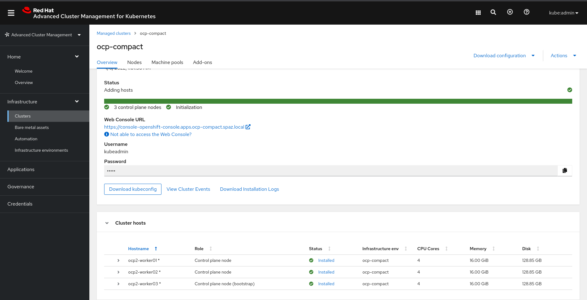
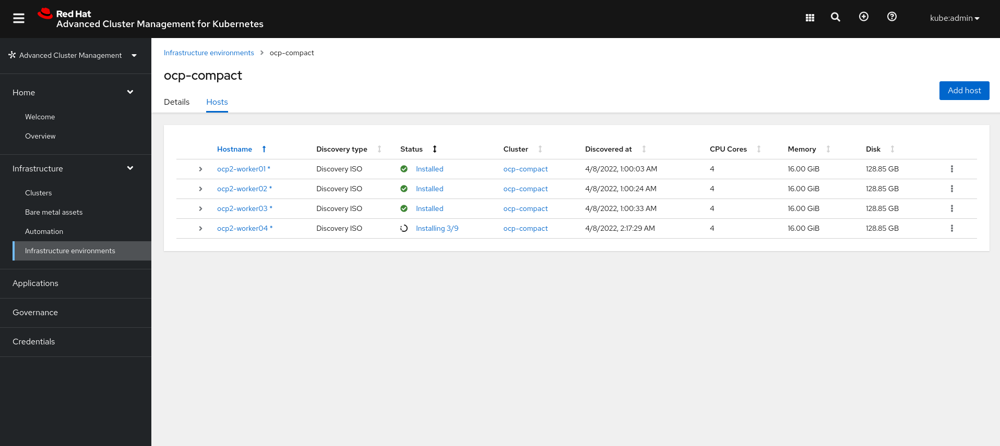
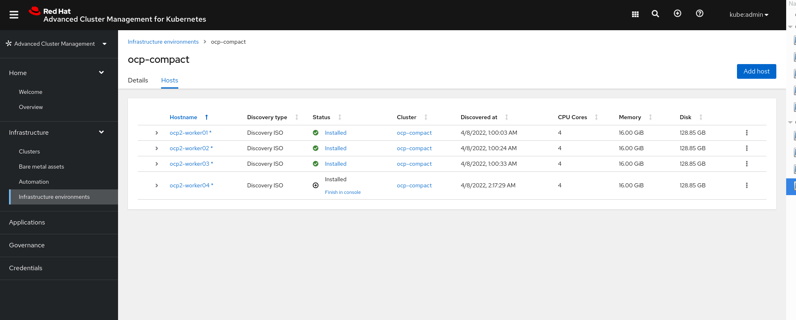
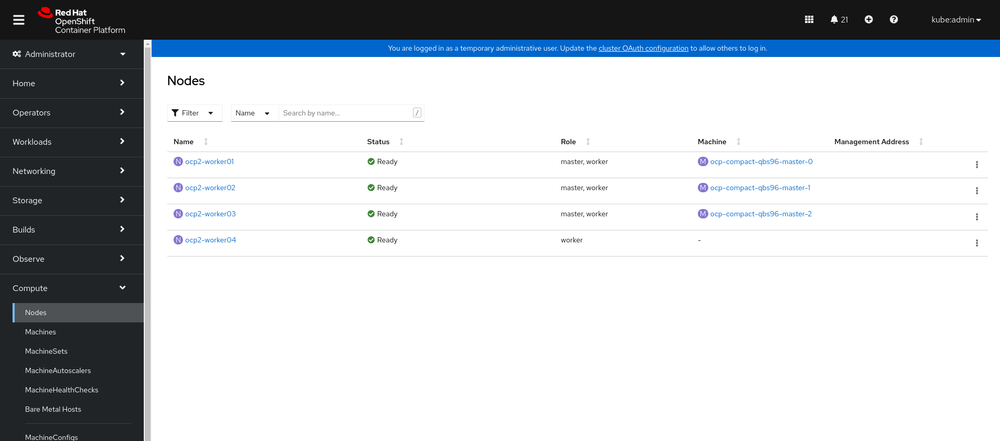

# Scaling Openshift UPI Clusters Using Central Infrastructure Management

Those of you who have dealt with Openshift User-Provisioner Infrastructure (specifically platform agnostic) implementations may already know that in order to scale an existing Openshift cluster you have two options.  

### Using A PXE server 

The server holds all the installation files for deploying Openshift, and the location for the ignition configuration files to be pulled when the server boots up. 

This method has some disadvantages as we need a dedicated DHCP network and a PXE server installed on our-premises. This is sometimes a challenge, as not all Openshift Administrators have the abillity to take care of those services inside their organization, they'd rather have a Vlan provided by Network Administrators so they'll be able to create static IPs to their Openshift machines. 

### Using The RHCOS LiveCD 

We can also boot our Openshift machines and push kernel arguments when they boot up. For example, where is the ignition located, which drive should be picked for installing the operating system, where is the installation image located, etc. 

This has some challenges as well, as Openshift Administrators need to push those arguments by hand, which slows the installation process, more error prone and exposed to human mistakes that will require booting the VM once again to push the right arguments. 

This is where we can use `CIM` (Central Infrastructure Management) component in order to solve those things. 

### About CIM 

`CIM` is a GUI-based component based on the upstream `Assisted Installer` project, and is now part of `ACM` (Advanced Cluster Management). 

`CIM` is able to deploy both UPI and IPI based clusters using a very useful UI for Openshift Administrators. 

In order to solve the challneges presented above, `CIM` manages the needed configuration using UI/Custom Resources. It takes the LiveCD ISO and bakes the ignition file into it (containing all the needed config, such as Static IP), so that the server will be able to boot up, register to CIM and start the installation. 

We can also create static IP configuration to our server, define DNS servers, search domains, routes, etc - All using `CIM` and `NMState`. 

Intrested on how to get this implemented? Let's go then! 

### Prerequisistes 

* A running UPI-based Openshift cluster, That was deployed by CIM 

* A Bastion machine for applying all Custom Resources 


### Deploying A Compact (Three-Node) Openshift Cluster 

A part of the prereqs is to have a running UPI-based Openshift cluser that was deployed by `CIM`, I won't cover the whole installation process and in order to understand how you can deploy it yourself, take a look at the following repository: 

After installing the cluster, you should see the following screen: 



Uf you'll take a look at the compact cluster installation directory (under the Github repo added here), I've created the cluster using `CIM`, with pre-defined `NMState` configuration that suites each one of my servers. 

Each `NMState` Custom Resource creation contains all the network configuration for a specific server. 

*Question - How does CIM know which CR to apply and which server to pick?*

`CIM` chooses the server based on their MAC address, it'll search the MAC address in the Custom Resource, and will apply the configuration to the server that matches that MAC address. 

To give an example, Let's take a look at our `NMState` configuration for those three servers: 

```bash
apiVersion: agent-install.openshift.io/v1beta1
kind: NMStateConfig
metadata:
  name: ocp2-worker01
  namespace: ocp-compact
  labels:
    cluster-name: ocp-compact
spec:
  config:
    interfaces:
    - name: eth1
      macAddress: 52:54:00:cd:3d:7a
      type: ethernet
      state: up
      ipv4:
        enabled: true
        address:
        - ip: 192.168.1.91
          prefix-length: 24
        dhcp: false
    dns-resolver:
      config:
        search:
        - spaz.local
        server:
        - 192.168.1.150
    routes:
      config:
      - destination: 0.0.0.0/0
        next-hop-address: 192.168.1.1
        next-hop-interface: eth1
  interfaces:
    - name: "eth1"
      macAddress: "52:54:00:cd:3d:7a"
```

As you can see, we have remarked the server's MAC address, so that `CIM` will know which server should get the presented network configuration. 

We can see that we've used static IP address configuration, added DNS servers, network routes, etc.

### Scaling The Cluster 

Assuming we want to add one more node to the cluster, and the ISO file contaning the ignition for the three installed servers was already generated, how do we update the static IP config for that extra node? 

No worries! `CIM` will get the additional CR for the new server, and will update the current ISO! 

Let's have a look at the fourth server's network configuration: 

```bash
apiVersion: agent-install.openshift.io/v1beta1
kind: NMStateConfig
metadata:
  name: ocp2-worker04
  namespace: ocp-compact
  labels:
    cluster-name: ocp-compact
spec:
  config:
    interfaces:
    - name: eth1
      macAddress: 52:54:00:8c:11:fe
      type: ethernet
      state: up
      ipv4:
        enabled: true
        address:
        - ip: 192.168.1.98
          prefix-length: 24
        dhcp: false
    dns-resolver:
      config:
        search:
        - spaz.local
        server:
        - 192.168.1.150
    routes:
      config:
      - destination: 0.0.0.0/0
        next-hop-address: 192.168.1.1
        next-hop-interface: eth1
  interfaces:
    - name: "eth1"
      macAddress: "52:54:00:8c:11:fe"
```

Now when you'll create the new config, `CIM` will take this `NMState` CR and create a new ISO file. 

Now, please take the new ISO, download it, and boot the fourth server from it until it gets discovered by `CIM`. 

When the servers shows on your screen, hit `Approve` to approve the host and the installation will immediately begin: 



Wait a few minutes for your server to finish the installation, until you see it finished in the `CIM` console: 



As you can see, `CIM` asks you to finish the installation, as the new worker has pending certificated that need to be approved. 

In order to approve those certificates (CSRs), you can use the console or use the following command: 

```bash
$ oc adm certificate approve <csr_name>
```

Now, lets take a look at the Openshift console to see if we see the new worker under the `Nodes` section: 



Great! now we have a new server, which static IP configuration added to our Openshift cluster :) 

Hope you've enjoyed this articale, see ya next time!