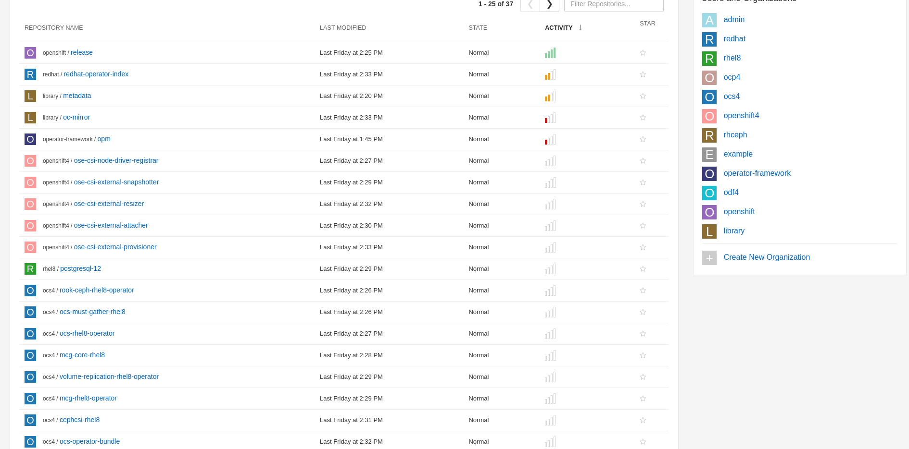
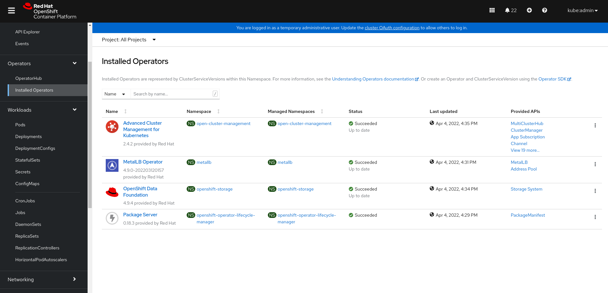

# Dealing With Air-Gapped Environments Just Got Much Easier 

Dealing with air-gapped environments can sometimes be challenging and costly in terms of time and effort put in order to provide customers the cloud-like user experience. 

Things differnciate too much and change too often, A thing which causes some of the simple procedures provided with the documentation to become much more complicated. 

As we give a declarative automation all of the credit with other components, it seems very logical to have things work the same way for image mirroing as well. 

In the articale, i'll explain how you can save time and ease the mirroring process for air-gapped environments using two very simple tools called `oc-mirror` and `mirror-registry`.

Let's get started!

### Prerequisites 

* A Bastion server based on RHEL8 operating system

### Preparations 

Download the needed installation files for to use both `mirror-registry` and `oc-mirror` tools: 

```bash 
$ wget https://developers.redhat.com/content-gateway/rest/mirror/pub/openshift-v4/clients/mirror-registry/latest/mirror-registry.tar.gz

$ wget https://mirror.openshift.com/pub/openshift-v4/amd64/clients/ocp-dev-preview/pre-release/oc-mirror.tar.gz
``` 

Make sure to extract the needed tools so you'll be able to use them locally on your bastion server: 

```bash
$ tar xvf oc-mirror.tar.gz -C /usr/local/bin/

$ chmod +x /usr/local/bin/oc-mirror
```

```bash
$ tar xvf mirror-registry.tar.gz 

image-archive.tar
execution-environment.tar
mirror-registry
```

As you can see, the `mirror-registry` tool comes with all needed container images for running a stand-alone `Quay` server. When deployed, `mirror-registry` will load those container images locally and deploy the disconnected registry instance using those images. 

### Creating An Offline Registry Using mirror-registry Tool

Create a directory for saving all the config files and root directories for the installation: 

```bash
$ mkdir disconnected-mirror && cd disconnected-mirror 
```

Now, we can start up our `Quay` instance locally, using `mirror-registry` CLI: 

```bash
$ ./mirror-registry install --quayHostname registry.spaz.local --initUser admin --initPassword password

INFO[2022-03-31 18:42:38] Install has begun                            
INFO[2022-03-31 18:42:38] Found execution environment at /root/disconnected-registry/execution-environment.tar 
INFO[2022-03-31 18:42:38] Loading execution environment from execution-environment.tar 
INFO[2022-03-31 18:43:06] Detected an installation to localhost        
INFO[2022-03-31 18:43:06] Did not find SSH key in default location. Attempting to set up SSH keys. 
INFO[2022-03-31 18:43:06] Generating SSH Key                           
INFO[2022-03-31 18:43:06] Generated SSH Key at /root/.ssh/quay_installer 
INFO[2022-03-31 18:43:06] Adding key to ~/.ssh/authorized_keys         
INFO[2022-03-31 18:43:06] Successfully set up SSH keys                 
INFO[2022-03-31 18:43:06] Attempting to set SELinux rules on /root/.ssh/quay_installer 
WARN[2022-03-31 18:43:06] Could not set SELinux rule. If your system does not have SELinux enabled, you may ignore this. 
INFO[2022-03-31 18:43:06] Found image archive at /root/disconnected-registry/image-archive.tar 
INFO[2022-03-31 18:43:06] Detected an installation to localhost        
INFO[2022-03-31 18:43:06] Unpacking image archive from /root/disconnected-registry/image-archive.tar 
INFO[2022-03-31 18:43:21] Loading pause image archive from pause.tar   
INFO[2022-03-31 18:43:42] Loading redis image archive from redis.tar   
INFO[2022-03-31 18:44:20] Loading postgres image archive from postgres.tar 
INFO[2022-03-31 18:44:39] Loading Quay image archive from quay.tar     
INFO[2022-03-31 18:45:46] Attempting to set SELinux rules on image archive 
WARN[2022-03-31 18:45:46] Could not set SELinux rule. If your system does not have SELinux enabled, you may ignore this. 
INFO[2022-03-31 18:45:46] Running install playbook. This may take some time. To see playbook output run the installer with -v (verbose) flag. 
INFO[2022-03-31 18:45:46] Detected an installation to localhost        
```

As you can see, `mirror-registry` makes sure to run all the needed validations so that our `Quay` instance can be succesfully deployed. 
When the installation finishes, you should see the following message: 

```bash 
INFO[2022-03-31 18:57:28] Quay installed successfully, permanent data is stored in /etc/quay-install 
INFO[2022-03-31 18:57:28] Quay is available at https://registry.spaz.local:8443 with credentials (admin, password)
```

That means that our `Quay` instance is up and running!
Let's make sure to validate that: 

```bash
$ podman pod ps

POD ID        NAME        STATUS      CREATED         INFRA ID      # OF CONTAINERS
7cd58c3158af  quay-pod    Running     39 seconds ago  4abd27e126dd  4
```

We see that we have four containers running in our podman pod, all are used for the needed `Quay` ecosystem. 

Try to access `Quay`'s URL to verify that the installation was successful: 


In order to mirror all the needed images successfully, you'll need to download the needed credentials from `Quay`, To do so navigate to `Account Settings` --> `Docker CLI Password` --> Make sure to insert your admin password --> `Docker Configuration` --> `Download admin-auth.json`. 


When downloaded you should see somethings similar to this json file: 

```bash 
{"auths":{"registry.spaz.local:8443":{"auth":"YWRtaW46QmFJZW04a3hMcVk0b3FkdmdLOHQ5Q3M4ejY5MUNNd2YySTRuRFRKblpGcE9MQ3pYNzYxZmhGemx2SjFOMVY1dg==","email":"spaz@redhat.com"}}}
```

*Make sure to add this section to your global pull secret, that can pull from Red Hat's registries - You can find it visiting `cloud.redhat.com` --> `Openshift` --> `Downloads` --> `pull-secret`*

Lets make sure that we can login to our `Quay` instance: 

```bash 
$ podman login --authfile pull-secret.json registry.spaz.local:8443 -u admin -p password --tls-verify=false

Login Succeeded!
```

Great! now let's update our trusted CA sources so that `oc-mirror` will be able to push images successfully to the offline registry: 

```bash
$ cp /etc/quay-install/quay-rootCA/rootCA.pem /etc/pki/ca-trust/source/anchors/

$ sudo update-ca-trust extract
```

Now we have all the needed prerequisistes for our offline registry, Let's move on to the next stage and mirror all the needed images! 

### Mirroring Images Using oc-mirror Tool 

The `oc-mirror` tool brings some new and useful features to the table, it's a declarative tool that can help us mirror images to and offline registry quite easily. 
All of oc-mirror's configuration is controlled with a single YAML file, that can mirror the Openshift installation media, operators, Helm charts, container images and even provides q very nice query tool for release channels and versions. 

For those of you who are familiar with how mirroring to an offline registry was made before, this is a dramatic and a very refreshing change. 

Let's start by saving the `admin-auth.json` file that we've downloaded in the previous stage to the needed directory, so that `oc-mirror` will be able to use it: 

```bash 
$ mkdir ~/.docker 

$ cp /root/auth-admin.json ~/.docker/config.json
```

As we've said before, `oc-mirror` is able to query the Red Hat's catalog indexes for channel releases for specific operators, Let's try to understand how. 

Let's try to query all of the supported operators with their latest versions, coming from the Openshift 4.9 release channel: 

```bash
$ oc-mirror list operators --catalog registry.redhat.io/redhat/redhat-operator-index:v4.9

NAME                                  DISPLAY NAME                                             DEFAULT CHANNEL
3scale-operator                       Red Hat Integration - 3scale                             threescale-2.11
advanced-cluster-management           Advanced Cluster Management for Kubernetes               release-2.4
amq-broker-rhel8                      Red Hat Integration - AMQ Broker for RHEL 8 (Multiarch)  7.x
amq-online                            Red Hat Integration - AMQ Online                         stable
amq-streams                           Red Hat Integration - AMQ Streams                        stable
amq7-interconnect-operator            Red Hat Integration - AMQ Interconnect                   1.10.x
ansible-automation-platform-operator  Ansible Automation Platform                              stable-2.1
ansible-cloud-addons-operator         Ansible Cloud Addons                                     stable-cluster-scoped
apicast-operator                      Red Hat Integration - 3scale APIcast gateway             threescale-2.11
aws-efs-csi-driver-operator           AWS EFS CSI Driver Operator                              stable
businessautomation-operator           Business Automation                                      stable
```

You see that we get the list for those operators. Before we had `oc-mirror`, we had to use `grpcurl` in order to extract a `packages.out` file and query those operators by hand. 

Now let's try to do the same, but now we'll try using a specific operator package, for example `odf-operator` taken from the previous stage: 

```bash
$ oc-mirror list operators --catalog registry.redhat.io/redhat/redhat-operator-index:v4.9 --package=odf-operator

PACKAGE       CHANNEL     HEAD
odf-operator  stable-4.9  odf-operator.v4.9.4
```

We see that we get the latest version for that operator package, which is `4.9.4`. Let's try it with some more operators: 

```bash 
$ oc-mirror list operators --catalog registry.redhat.io/redhat/redhat-operator-index:v4.9 --package=mcg-operator
 
PACKAGE       CHANNEL     HEAD
mcg-operator  stable-4.9  mcg-operator.v4.9.4
```

```bash
$ oc-mirror list operators --catalog registry.redhat.io/redhat/redhat-operator-index:v4.9 --package=ocs-operator

PACKAGE       CHANNEL     HEAD
ocs-operator  eus-4.8     ocs-operator.v4.8.9
ocs-operator  stable-4.8  ocs-operator.v4.8.9
ocs-operator  stable-4.9  ocs-operator.v4.9.4
```

```bash
$ oc-mirror list operators --catalog registry.redhat.io/redhat/redhat-operator-index:v4.9 --package=metallb-operator

PACKAGE           CHANNEL  HEAD
metallb-operator  4.9      metallb-operator.4.9.0-202203120157
metallb-operator  stable   metallb-operator.4.9.0-202203120157
```

Now that we've understood how we can query things, Let's create the overall YAML file that will tell `oc-mirror` whhat  it should mirror: 

```bash
apiVersion: mirror.openshift.io/v1alpha1
kind: ImageSetConfiguration
archiveSize: 1
mirror:
 ocp:
   channels:
     - name: stable-4.9
       versions: 
       - "4.9.19"
 operators: 
   - catalog: registry.redhat.io/redhat/redhat-operator-index:v4.9
     headsonly: false  
     packages:
       - name: odf-operator
         startingVersion: '4.9.4'
       - name: mcg-operator 
         startingVersion: '4.9.4'
       - name: ocs-operator 
         startingVersion: '4.9.4'
       - name: metallb-operator 
         startingVersion: '4.9.0-202203120157'
       - name: advanced-cluster-management 
         startingVersion: '2.4.2'
       - name: multicluster-engine 
         startingVersion: '1.0.0'
storageConfig: 
 registry:
   imageURL: registry.spaz.local:8443/metadata
```

We see that we have three different sections: 

* `ocp` stands for the Openshift installation media, I chose to mirror the `4.9.19` version 

* `operators` stands for the operator packages that sould be taken from a given channel release, for example all operator packages that support Openshift 4.9, with a specific version 

* `StorageConfig` stands for the backend registry to be used for mirroring 

Now let's start mirroring! 

```bash
$ oc-mirror --config=mirror-config.yaml docker://registry.spaz.local:8443

INFO Checking push permissions for registry.spaz.local:8443 
workspace: ./mirrortmp3916255698
INFO Creating directory: oc-mirror-workspace/src/publish 
INFO Creating directory: oc-mirror-workspace/src/v2 
INFO Creating directory: oc-mirror-workspace/src/charts 
INFO Downloading requested release 4.9.19         
info: Mirroring 141 images to file://openshift/release ...
```

As you can see the mirroring phase has started, and once finished you'll have all the needed images in our offline registry: 



In order to take the `Quay` data dir to your actual offline location, make sure to bring the `/etc/quay-install` registry with you. 

This directroy will be used in the disconnected environment in order to feed the new `mirror-registry` instance with the mirrored data.

Uninstall you connected `Quay` instance *without* deleting its content: 

```bash
$ ./mirror-registry uninstall

   __   __
  /  \ /  \     ______   _    _     __   __   __
 / /\ / /\ \   /  __  \ | |  | |   /  \  \ \ / /
/ /  / /  \ \  | |  | | | |  | |  / /\ \  \   /
\ \  \ \  / /  | |__| | | |__| | / ____ \  | |
 \ \/ \ \/ /   \_  ___/  \____/ /_/    \_\ |_|
  \__/ \__/      \ \__
                  \___\ by Red Hat
 Build, Store, and Distribute your Containers
	
INFO[2022-04-10 17:33:08] Uninstall has begun                          
Are you sure want to delete quayRoot directory /etc/quay-install? [y/n] n
```

Make sure that our pod has evacuated successfuly:

```bash 
$ podman pod ps

POD ID      NAME        STATUS      CREATED     INFRA ID    # OF CONTAINERS
```

And that we have all the data saved in our `/etc/quay-install` directory: 

```bash 
$ ll /etc/quay-install/

total 0
drwxrwxr-x+ 3 root root 22 Mar 31 18:56 pg-data
drwxr-xr-x  2 root root 90 Mar 31 18:56 quay-config
drwxr-xr-x  2 root root 60 Mar 31 18:56 quay-rootCA
drwxrwxr-x+ 4 root root 35 Apr  1 06:04 quay-storage
```

*Note!* Make sure to take the `disconnected-mirror` directory that was created in the previous stages, as it holds all the `oc-mirror` metadata. 

### Getting This Magic Into An Air-Gapped Environment 

In your offline environment, run the following command to feed `mirror-registry` with the mirrored data: 

```bash
$ ./mirror-registry install --quayHostname registry.spaz.local --initUser admin --initPassword password --quayRoot /etc/quay-install/ 
```

In an air-gapped environment we also need that `catalogSource` and `imageContentSourcePolicy` files so that we'll be able to use our disconnected catalog from `Operaator Hub` and install all the operator dependecy images. 

The `oc-mirror` tool creates a workspace under the provided `disconnected-mirror` directory, that holds the `catalogSource` and `imageContentSourcePolicy` files under a sub-directory called `results-*`:

```bash
$ ll oc-mirror-workspace/results-1648812081/

total 8
-rwxr-xr-x 1 root root  230 Apr  1 07:33 catalogSource-redhat-operator-index.yaml
drwxr-xr-x 2 root root    6 Apr  1 07:21 charts
-rwxr-xr-x 1 root root 1101 Apr  1 07:33 imageContentSourcePolicy.yaml
```

The cool thing is that `oc-mirror` will update those files with every change that is made during the mirroring phase, for example - adding a new operator package to the mirror and updating the `catalogSource` image, so as the `imageContentSourcePolicy` file. 

An example of how the `imageContenctSourcePolicy` file looks like: 

```bash 
---
apiVersion: operator.openshift.io/v1alpha1
kind: ImageContentSourcePolicy
metadata:
  labels:
    operators.openshift.org/catalog: "true"
  name: catalog-0
spec:
  repositoryDigestMirrors:
  - mirrors:
    - registry.spaz.local:8443/rhel8
    source: registry.redhat.io/rhel8
  - mirrors:
    - registry.spaz.local:8443/rhacm2
    source: registry.redhat.io/rhacm2
  - mirrors:
    - registry.spaz.local:8443/odf4
    source: registry.redhat.io/odf4
  - mirrors:
    - registry.spaz.local:8443/redhat
    source: registry.redhat.io/redhat
  - mirrors:
    - registry.spaz.local:8443/multicluster-engine
    source: registry.redhat.io/multicluster-engine
  - mirrors:
    - registry.spaz.local:8443/openshift4
    source: registry.redhat.io/openshift4
  - mirrors:
    - registry.spaz.local:8443/rhceph
    source: registry.redhat.io/rhceph
  - mirrors:
    - registry.spaz.local:8443/ocs4
    source: registry.redhat.io/ocs4
---
apiVersion: operator.openshift.io/v1alpha1
kind: ImageContentSourcePolicy
metadata:
  name: release-0
spec:
  repositoryDigestMirrors:
  - mirrors:
    - registry.spaz.local:8443/openshift/release
    source: quay.io/openshift-release-dev/ocp-release
  - mirrors:
    - registry.spaz.local:8443/openshift/release
    source: quay.io/openshift-release-dev/ocp-v4.0-art-dev
```

This is exactly what we've mirrored in the previous stages, all the repositories needed for installing `odf-operator`, `metallb-operator`, `advanced-cluster-management`, etc. 

Make sure to apply those files in your disconnected environment: 

```bash
$ oc apply -f oc-mirror-workspace/results-1648812081/imageContentSourcePolicy.yaml 

$ oc-mirror-workspace/results-1648812081/catalogSource-redhat-operator-index.yaml
```

Now you can test the operator installation using the Openshift console, in the `Operator Hub` section: 




