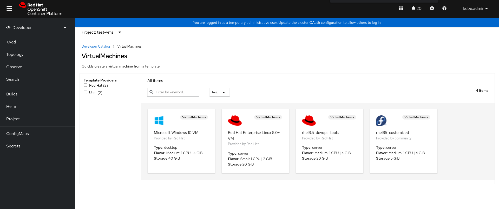
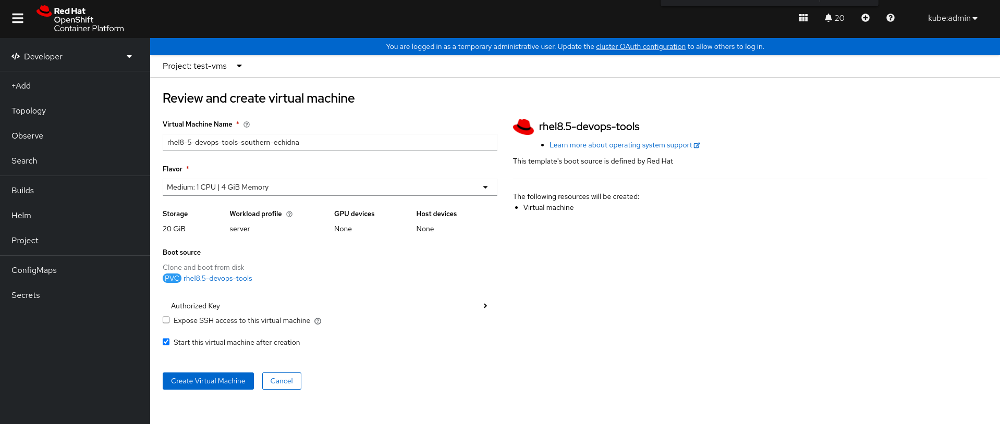
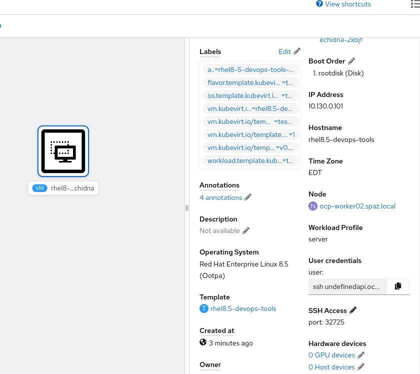

# Build Golden Images For Your Openshift Virtualization Cloud Using RHEL Image Builder 

In this demo, I'd like to share the way you could create your custom golden image, based on `RHEL 8.5` operating system, and publish it to `Openshift Virtualization` so that your customers will be able to use custom templates. 

First, we'll use the `RHEL Image Builder` utility in order to create a custom `qcow2` image with pre-defined users, packages, hostnames, etc. 

Then, we'll publish the image to `Openshift Virtualization` as a Data Volume, that will be used by a created template. 

When the template is ready, we'll deploy a VM from that template and make sure all of our wanted configurations are valid. 

Let the game begin!

## Prerequisistes 
* An Installed Openshift Cluster (4.10)
* An Installed Openshift Virtualization Operator (4.10)
* A RHEL server to compose & Upload images 

### Compose Your Custom RHEL8.5 QCOW2 Image

Let's first install all the needed utillities for composing the wanted `rhel8.5` image: 

```bash
$ yum install -y lorax-composer composer-cli
```

Now, we'll enable the needed services for the compose process to work properly: 

```bash
$ systemctl enable --now osbuild-composer.socket && systemctl start --now osbuild-composer.socket
```

Let's take a look at the `.toml` file that is used as the blueprint for the `rhel8.5` custom image that we want to build: 

```bash
name = "rhel8.5-devops-tools"
description = "This image is used for developers searching for pre-build DevOps ariented rhel8.5 os"
version = "0.0.1"
modules = []
groups = []
distro = ""

[[packages]]
name = "wget"
version = "*"

[[packages]]
name = "git"
version = "*"

[customizations]
hostname = "rhel8"

[[customizations.user]]
name = "spaz"
description = "spaz"
password = "$6$pJXZ3nD7NbAXr2A8$.Mv9dKlxBoihmeSpTjpt61zuA0X9GCUZu/Wb/jRvJKpzgCb7IliVx7Pr6GTKa3zL6s3zl30SkbzZo5vWZkJCz/"
key = "ssh-rsa ..."
groups = ["wheel"]
```

We can see that using the blueprint `.toml` file, we can give the blueprint a name, give it a version to control diffrences, install packages, create users with SSH keys and passwords, and provide a hostname. 

Now let's push the blueprint so that we'll be able to start the compose process. Pushing the blueprint config preservs the configuration vresion: 

```bash
$ composer-cli blueprints push rhel8.5-devops-tools.toml
```

If you want to see if the config was applies properly, you can use the following command: 

```bash
$ composer-cli blueprints show rhel8.5-devops-tools

name = "rhel8.5-devops-tools"
description = "This image is used for developers searching for pre-build DevOps ariented rhel8.5 os"
version = "0.0.1"
modules = []
groups = []
distro = ""
.
.
.
```

Now let's start the compose process, and save the composed image in `qcow2` format, so that we'll be able to use in in `Openshift Virtualization`:

```bash
$ composer-cli compose start rhel8.5-devops-tools qcow2

Compose ecad14a5-1123-4e10-9edf-172152495eb2 added to the queue
```

When the compose process finishes, you could verify that is has completed properly: 

```bash
$ composer-cli compose status 

c7d6247c-70a7-4bea-90aa-61a647ffacbe FINISHED Wed Jun 1 05:05:30 2022 rhel8.5-devops-tools 0.0.1 qcow2            10737418240
```

Now, we have the image ready in a `qcow2` format, let's download it so we could upload it as a `Data Volume` for our customized VM: 

```bash
$ composer-cli compose image c7d6247c-70a7-4bea-90aa-61a647ffacbe

c7d6247c-70a7-4bea-90aa-61a647ffacbe-disk.qcow2
```

Now let's verify that is was written to our local filesystem in the current directory we are in: 

```bash
$ ll -h *.qcow2

-rw------- 1 root root 784M Jun  1 05:07 c7d6247c-70a7-4bea-90aa-61a647ffacbe-disk.qcow2
```

Great! now let's dealt with uploading this image to `Openshift Virtualization`. 

### Upload Your QCOW2 Image As Data Volume 

In order to upload this `qcow2` image as a Data Volume, we'll have to use the `virtctl` CLI that interacts with `Openshift Virtualization`'s API, You could download it from the following link in your cluster that hosts the operator: 

```bash
$ wget https://hyperconverged-cluster-cli-download-openshift-cnv.apps.<cluster_name>.<domain>/amd64/linux/virtctl.tar.gz --no-check-certificate
```

Now let's use the utility to upload this image: 

```bash
$ virtctl image-upload dv rhel8.5-devops-tools --size=20G --image-path=c7d6247c-70a7-4bea-90aa-61a647ffacbe-disk.qcow2 --insecure

PVC test-vms/rhel8.5-devops-tools not found 
DataVolume test-vms/rhel8.5-devops-tools created
Waiting for PVC rhel8.5-devops-tools upload pod to be ready...
Pod now ready
Uploading data to https://cdi-uploadproxy-openshift-cnv.apps.ocp.spaz.local

 783.62 MiB / 783.62 MiB [=========================================================================================================] 100.00% 3m19s

Uploading data completed successfully, waiting for processing to complete, you can hit ctrl-c without interrupting the progress
Processing completed successfully
Uploading c7d6247c-70a7-4bea-90aa-61a647ffacbe-disk.qcow2 completed successfully
```

Let's verify that the Data Volume exists and available to use: 

```bash
$ oc get dv | grep rhel8.5-devops-tools

rhel8.5-devops-tools                          Succeeded   N/A                   13m
```

Now, let's create a VM template using that Data Volume. When starting up the VM, it'll use the provided Data Volume as the boot volume for the VM, with all ths install packages that we've asked for: 


Verify that the template was successuflly created: 

```bash
$ oc get template

NAME                   DESCRIPTION   PARAMETERS    OBJECTS
rhel8.5-devops-tools                 2 (1 blank)   1
```

Make sure that you see the template form the `Developer` tab in your cluster: 



Now, make sure to create a VM from that template, simulating a user that tried to order a new DevOps VM as a service: 



Hit the `Create` button and wait for the VM to finish its strartup phase: 



The VM is created, and SSH is fully available using a `NodePort` service (you can also use `MetalLB` if you want your VM to get its own external flowting IP address). 

Now, that our VM is up and running, we can verify that we can log-in with the proper user, make sure that the hostname was successfully changed and that we have our packages installed: 

```bash

$ ssh spaz@ocp-worker02.spaz.local -p 32725

Activate the web console with: systemctl enable --now cockpit.socket

Register this system with Red Hat Insights: insights-client --register
Create an account or view all your systems at https://red.ht/insights-dashboard
Last login: Wed Jun  1 06:19:30 2022 from 10.130.0.1

[spaz@rhel8 ~]$ which git
/usr/bin/git
```

Nice! We have our VM created from a template created in `Openshift Virtualization`, using the image that was created using the `RHEL Image Builder utility`. 

Using these capabilities, we can make sure to create templates in an automated and secured way, to make sure that customers are using fully supported golden images for their cloud service. 

Hope you've enjoyed this demo, See ya next time!